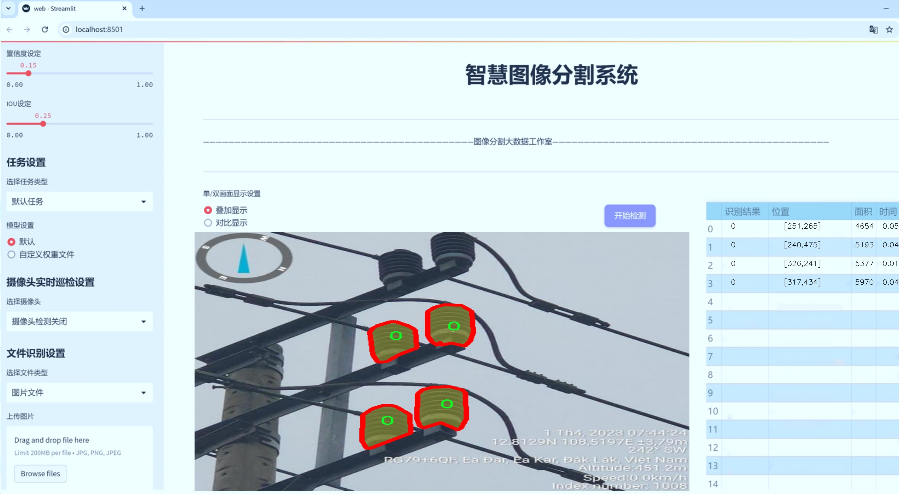
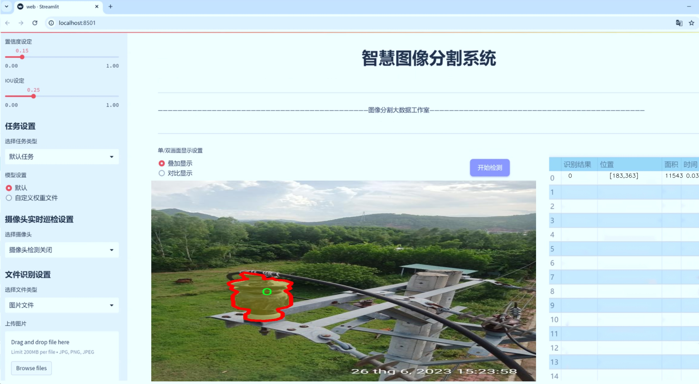
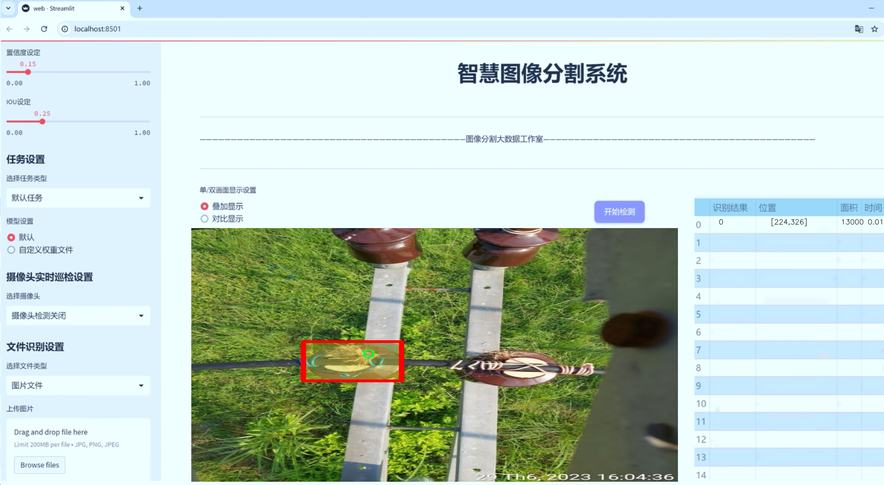
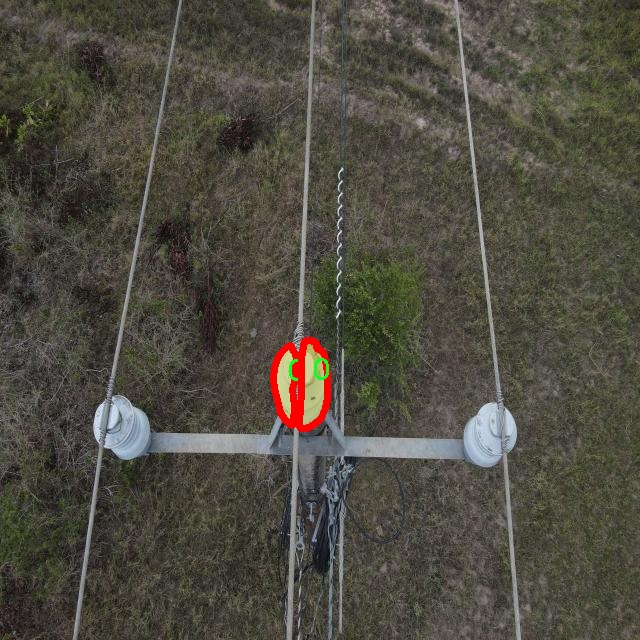
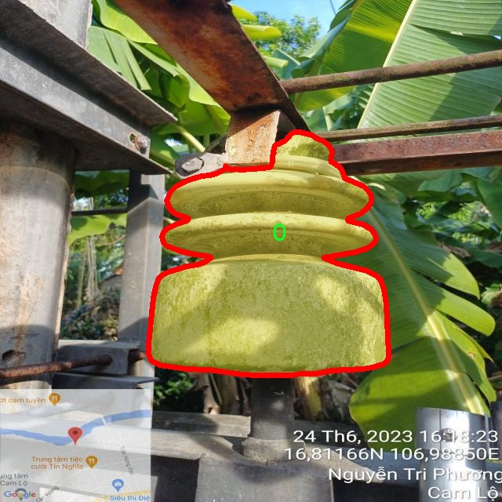
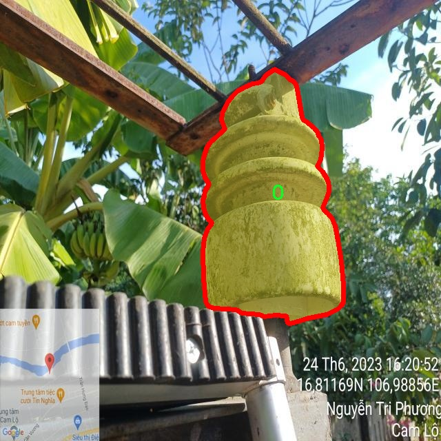
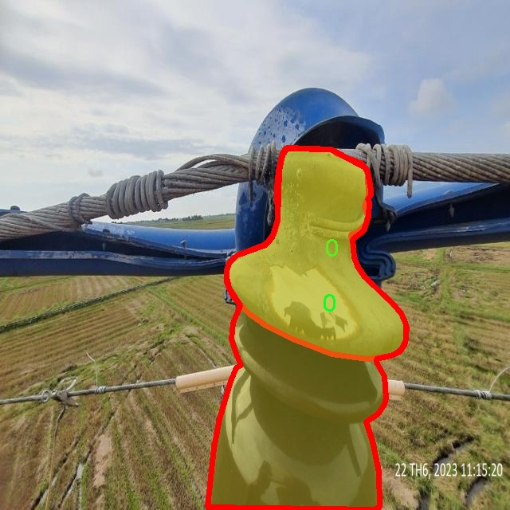
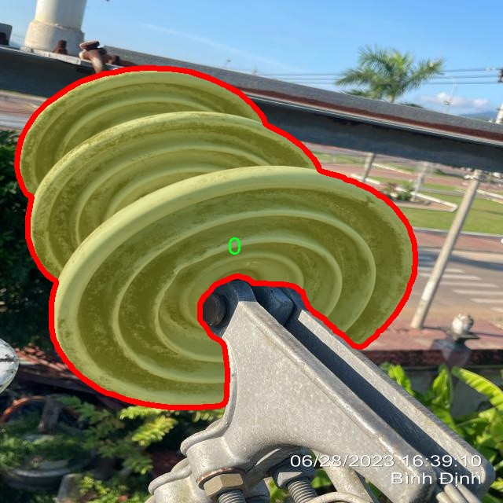

# 绝缘子图像分割系统源码＆数据集分享
 [yolov8-seg-C2f-FocusedLinearAttention＆yolov8-seg-C2f-DLKA等50+全套改进创新点发刊_一键训练教程_Web前端展示]

### 1.研究背景与意义

项目参考[ILSVRC ImageNet Large Scale Visual Recognition Challenge](https://gitee.com/YOLOv8_YOLOv11_Segmentation_Studio/projects)

项目来源[AAAI Global Al lnnovation Contest](https://kdocs.cn/l/cszuIiCKVNis)

研究背景与意义

随着电力系统的不断发展与城市化进程的加快，电力设施的安全性与可靠性日益受到重视。绝缘子作为电力传输系统中至关重要的组成部分，其状态的良好与否直接影响到电力系统的稳定运行。传统的绝缘子检测方法多依赖人工巡检，不仅效率低下，而且容易受到人为因素的影响，导致漏检或误检现象的发生。因此，亟需一种高效、准确的自动化检测技术，以提升绝缘子检测的精度和效率。

近年来，计算机视觉与深度学习技术的快速发展为绝缘子检测提供了新的解决方案。YOLO（You Only Look Once）系列模型因其高效的实时目标检测能力而受到广泛关注。YOLOv8作为该系列的最新版本，进一步提升了检测精度和速度，尤其在复杂场景下的表现尤为突出。然而，针对绝缘子图像的分割任务，YOLOv8的原始模型在处理细节和复杂背景时仍存在一定的局限性。因此，基于YOLOv8的改进方案，结合绝缘子图像的特征，开展图像分割研究具有重要的理论和实际意义。

本研究所采用的数据集SHIT包含1100张绝缘子图像，涵盖了三类不同的绝缘子。这一数据集为模型的训练与验证提供了丰富的样本，能够有效支持模型在不同环境下的适应性学习。通过对该数据集的深入分析，可以识别出绝缘子在不同状态下的特征，从而为模型的改进提供数据支持。此外，数据集中多样化的图像背景和光照条件也为模型的鲁棒性提升提供了挑战，促使我们在改进YOLOv8时，探索更为有效的特征提取与图像分割策略。

在实际应用中，基于改进YOLOv8的绝缘子图像分割系统不仅能够提高绝缘子检测的效率，还能为电力公司提供精准的维护决策依据，降低因绝缘子故障引发的电力事故风险。通过自动化的图像分割技术，电力巡检人员可以更快速地识别出潜在的故障点，及时进行维护和更换，确保电力系统的安全稳定运行。

综上所述，基于改进YOLOv8的绝缘子图像分割系统的研究，不仅具有重要的学术价值，还具有广泛的应用前景。通过深入探讨和优化该系统，可以为电力行业的智能化发展提供有力支持，推动电力设备的智能检测与维护技术的进步，最终实现电力系统的高效、可靠与安全运行。

### 2.图片演示







##### 注意：由于此博客编辑较早，上面“2.图片演示”和“3.视频演示”展示的系统图片或者视频可能为老版本，新版本在老版本的基础上升级如下：（实际效果以升级的新版本为准）

  （1）适配了YOLOV8的“目标检测”模型和“实例分割”模型，通过加载相应的权重（.pt）文件即可自适应加载模型。

  （2）支持“图片识别”、“视频识别”、“摄像头实时识别”三种识别模式。

  （3）支持“图片识别”、“视频识别”、“摄像头实时识别”三种识别结果保存导出，解决手动导出（容易卡顿出现爆内存）存在的问题，识别完自动保存结果并导出到tempDir中。

  （4）支持Web前端系统中的标题、背景图等自定义修改，后面提供修改教程。

  另外本项目提供训练的数据集和训练教程,暂不提供权重文件（best.pt）,需要您按照教程进行训练后实现图片演示和Web前端界面演示的效果。

### 3.视频演示

[3.1 视频演示](https://www.bilibili.com/video/BV1hv15YLE4s/)

### 4.数据集信息展示

##### 4.1 本项目数据集详细数据（类别数＆类别名）

nc: 3
names: ['0', '1', '2']


##### 4.2 本项目数据集信息介绍

数据集信息展示

在本研究中，我们使用了名为“SHIT”的数据集，以训练和改进YOLOv8-seg模型，专注于绝缘子图像的分割任务。该数据集的设计旨在为电力行业提供高效的图像处理解决方案，特别是在绝缘子检测和故障诊断方面。数据集包含三类主要对象，分别用数字“0”、“1”和“2”进行标识，代表不同类型的绝缘子。这种分类方式不仅简洁明了，而且便于模型在训练过程中进行快速识别和学习。

数据集的构建经过精心设计，确保了数据的多样性和代表性。我们从多个电力设施和环境中收集了大量绝缘子图像，涵盖了不同的拍摄角度、光照条件和背景干扰。这种多样性使得模型在训练时能够学习到更为丰富的特征，从而提高其在实际应用中的鲁棒性和准确性。数据集中每一类绝缘子都包含了大量的标注图像，这些图像经过专业人员的精确标注，确保了训练数据的高质量。

在数据预处理阶段，我们对图像进行了标准化处理，包括尺寸调整、颜色归一化等，以适应YOLOv8-seg模型的输入要求。此外，为了增强模型的泛化能力，我们还采用了数据增强技术，如随机裁剪、旋转、翻转等。这些技术不仅增加了数据集的有效样本数量，还提高了模型对不同环境变化的适应能力。

在训练过程中，我们使用了交叉验证的方法，以确保模型的性能评估更加准确。通过将数据集划分为训练集和验证集，我们能够有效监控模型的学习进度，并及时调整超参数，以达到最佳的训练效果。我们还利用了迁移学习的策略，基于预训练的YOLOv8-seg模型进行微调，从而加速训练过程并提高模型的收敛速度。

在模型评估阶段，我们采用了多种指标来衡量分割效果，包括交并比（IoU）、精确率和召回率等。这些指标能够全面反映模型在不同类别绝缘子分割任务中的表现。通过对比实验，我们发现，改进后的YOLOv8-seg模型在绝缘子图像分割任务中展现出了显著的性能提升，尤其是在复杂背景和光照变化的情况下，模型依然能够保持较高的分割精度。

综上所述，SHIT数据集为本研究提供了坚实的基础，通过精心的设计和丰富的样本，确保了模型训练的有效性和准确性。未来，我们计划进一步扩展数据集，增加更多类别的绝缘子图像，以提升模型的应用范围和实用性。通过不断优化和改进，我们希望能够为电力行业的智能化发展贡献一份力量。











### 5.全套项目环境部署视频教程（零基础手把手教学）

[5.1 环境部署教程链接（零基础手把手教学）](https://www.bilibili.com/video/BV1jG4Ve4E9t/?vd_source=bc9aec86d164b67a7004b996143742dc)


[5.2 安装Python虚拟环境创建和依赖库安装视频教程链接（零基础手把手教学）](https://www.bilibili.com/video/BV1nA4VeYEze/?vd_source=bc9aec86d164b67a7004b996143742dc)

### 6.手把手YOLOV8-seg训练视频教程（零基础小白有手就能学会）

[6.1 手把手YOLOV8-seg训练视频教程（零基础小白有手就能学会）](https://www.bilibili.com/video/BV1cA4VeYETe/?vd_source=bc9aec86d164b67a7004b996143742dc)


按照上面的训练视频教程链接加载项目提供的数据集，运行train.py即可开始训练



     Epoch   gpu_mem       box       obj       cls    labels  img_size
     1/200     0G   0.01576   0.01955  0.007536        22      1280: 100%|██████████| 849/849 [14:42<00:00,  1.04s/it]
               Class     Images     Labels          P          R     mAP@.5 mAP@.5:.95: 100%|██████████| 213/213 [01:14<00:00,  2.87it/s]
                 all       3395      17314      0.994      0.957      0.0957      0.0843

     Epoch   gpu_mem       box       obj       cls    labels  img_size
     2/200     0G   0.01578   0.01923  0.007006        22      1280: 100%|██████████| 849/849 [14:44<00:00,  1.04s/it]
               Class     Images     Labels          P          R     mAP@.5 mAP@.5:.95: 100%|██████████| 213/213 [01:12<00:00,  2.95it/s]
                 all       3395      17314      0.996      0.956      0.0957      0.0845

     Epoch   gpu_mem       box       obj       cls    labels  img_size
     3/200     0G   0.01561    0.0191  0.006895        27      1280: 100%|██████████| 849/849 [10:56<00:00,  1.29it/s]
               Class     Images     Labels          P          R     mAP@.5 mAP@.5:.95: 100%|███████   | 187/213 [00:52<00:00,  4.04it/s]
                 all       3395      17314      0.996      0.957      0.0957      0.0845


### 7.50+种全套YOLOV8-seg创新点代码加载调参视频教程（一键加载写好的改进模型的配置文件）

[7.1 50+种全套YOLOV8-seg创新点代码加载调参视频教程（一键加载写好的改进模型的配置文件）](https://www.bilibili.com/video/BV1Hw4VePEXv/?vd_source=bc9aec86d164b67a7004b996143742dc)

### 8.YOLOV8-seg图像分割算法原理

原始YOLOv8-seg算法原理

YOLOv8-seg算法是Ultralytics公司在2023年推出的YOLO系列中的最新版本，它在前几代YOLO算法的基础上进行了重要的改进和创新，特别是在目标检测和图像分割任务中的应用。YOLOv8-seg不仅保持了YOLO系列一贯的高效性和准确性，还通过引入新的网络结构和优化策略，进一步提升了性能和灵活性，使其在处理复杂场景时表现得更加出色。

YOLOv8-seg的网络结构设计围绕着快速、准确和易于使用的理念展开，适应了不同应用场景的需求。其输入部分默认图像尺寸为640x640，但在实际应用中，YOLOv8-seg采用了自适应图片缩放技术，以应对不同长宽比的图像。这种方法通过将长边按比例缩小到指定尺寸，并对短边进行填充，最大限度地减少了信息冗余，从而提高了目标检测和推理的速度。此外，在模型训练阶段，YOLOv8-seg引入了Mosaic图像增强技术，通过随机拼接多张图像，丰富了训练样本的多样性，提升了模型的泛化能力和预测精度。

在主干网络部分，YOLOv8-seg对传统的C3模块进行了优化，采用了C2F模块。C2F模块通过并行化更多的梯度流分支，确保了轻量化的同时获取了更丰富的特征信息。这种设计不仅提高了模型的精度，还有效降低了延迟，使得YOLOv8-seg在实时应用中表现得尤为出色。与此同时，YOLOv8-seg在Neck部分也进行了结构上的改进，去除了多余的卷积连接层，直接对不同阶段输出的特征进行上采样，进一步简化了网络结构。

YOLOv8-seg的Head部分是其创新的核心，采用了Decoupled-Head结构，分别处理目标检测和分类任务。这种解耦设计使得每个任务可以独立优化，从而提高了整体性能。具体而言，YOLOv8-seg在分类分支中使用了二值交叉熵损失（BCELoss），而在边界框回归分支中则引入了分布焦点损失（DFL）和完美交并比损失（CIoULoss），这使得模型能够更快速地聚焦于标签附近的区域，提升了定位精度。

值得注意的是，YOLOv8-seg摒弃了传统的Anchor-Based方法，转而采用Anchor-Free的策略。这一创新使得目标检测的过程更加灵活，不再依赖于预设的锚框，从而简化了模型的训练过程。YOLOv8-seg将目标检测视为关键点检测，避免了对锚框的复杂计算，提高了模型的泛化能力和计算效率。

在算法思想上，YOLOv8-seg不仅延续了YOLO系列的跨级结构（CSP）设计，还结合了空间金字塔池化模块，以进一步增强特征提取能力。通过引入新的损失策略，YOLOv8-seg能够更准确地进行目标检测，尤其是在复杂场景中表现得尤为突出。这些改进使得YOLOv8-seg在处理不同尺度和形状的目标时，能够保持高效的检测性能。

综上所述，YOLOv8-seg算法通过一系列结构上的创新和优化，不仅提升了目标检测的精度和速度，还增强了对复杂场景的适应能力。其自适应的输入处理、轻量化的主干网络、解耦的Head结构以及无锚框的检测方式，使得YOLOv8-seg在实际应用中展现出极大的灵活性和高效性。这些特性使得YOLOv8-seg成为了当前目标检测和图像分割领域中一个极具竞争力的算法选择，适用于各种实际应用场景。


### 9.系统功能展示（检测对象为举例，实际内容以本项目数据集为准）

图9.1.系统支持检测结果表格显示

  图9.2.系统支持置信度和IOU阈值手动调节

  图9.3.系统支持自定义加载权重文件best.pt(需要你通过步骤5中训练获得)

  图9.4.系统支持摄像头实时识别

  图9.5.系统支持图片识别

  图9.6.系统支持视频识别

  图9.7.系统支持识别结果文件自动保存

  图9.8.系统支持Excel导出检测结果数据


### 10.50+种全套YOLOV8-seg创新点原理讲解（非科班也可以轻松写刊发刊，V11版本正在科研待更新）

#### 10.1 由于篇幅限制，每个创新点的具体原理讲解就不一一展开，具体见下列网址中的创新点对应子项目的技术原理博客网址【Blog】：


[10.1 50+种全套YOLOV8-seg创新点原理讲解链接](https://gitee.com/qunmasj/good)

#### 10.2 部分改进模块原理讲解(完整的改进原理见上图和技术博客链接)【如果此小节的图加载失败可以通过CSDN或者Github搜索该博客的标题访问原始博客，原始博客图片显示正常】
### 全维动态卷积ODConv
鉴于上述讨论，我们的ODConv引入了一种多维注意机制，该机制具有并行策略，用于学习卷积核在核空间的所有四个维度上的不同注意。图提供了CondConv、DyConv和ODConv的示意性比较。

ODConv的公式：根据等式1中的符号，ODConv可定义为


 将注意力标量分配给整个卷积核。图2示出了将这四种类型的关注乘以n个卷积核的过程。原则上，这四种类型的关注是相互补充的，并且以位置、信道、滤波器和核的顺序将它们逐步乘以卷积核 
 ，使得卷积运算不同w.r.t.所有空间位置、所有输入信道、所有滤波器和输入x的所有核，提供捕获丰富上下文线索的性能保证。因此，ODConv可以显著增强CNN基本卷积运算的特征提取能力。此外，具有单个卷积核的ODConv可以与标准CondConv和DyConv竞争或优于它们，为最终模型引入的额外参数大大减少。提供了大量实验来验证这些优点。通过比较等式1和等式2，我们可以清楚地看到，ODConv是一种更广义的动态卷积。此外，当设置n=1且 所有分量均为1时，只关注滤波器方向 的ODConv将减少为：将基于输入特征的SE变量应用于卷积滤波器，然后进行卷积运算（注意原始SE（Hu等人，2018b）基于输出特征，并且用于重新校准输出特征本身）。这种SE变体是ODConv的特例。


图：将ODConv中的四种注意类型逐步乘以卷积核的示例。（a） 沿空间维度的逐位置乘法运算，（b）沿输入信道维度的逐信道乘法运算、（c）沿输出信道维度的按滤波器乘法运算，以及（d）沿卷积核空间的核维度的按核乘法运算。方法部分对符号进行了说明
实现：对于ODConv，一个关键问题是如何计算卷积核的四种关注度 。继CondConv和DyConv之后，我们还使用SE型注意力模块（Hu等人，2018b），但将多个头部作为来计算它们，其结构如图所示。具体而言，首先通过逐通道全局平均池（GAP）运算将输入压缩到具有长度的特征向量中。随后，存在完全连接（FC）层和四个头部分支。ReLU（Krizhevsky等人，2012）位于FC层之后。FC层将压缩特征向量映射到具有缩减比的低维空间（根据消融实验，我们在所有主要实验中设置 ，避免了高模型复杂度）。对于四个头部分支，每个分支都有一个输出大小如图。

### 引入ODConv的改进YOLO
参考这篇博客涵盖了引入ODConv的改进YOLOv8系统的内容，ODConv采用多维注意机制，在卷积核空间的四个维度上学习不同的注意。结合了CondConv和DyConv的优势，ODConv通过图示的四种注意类型逐步与卷积核相乘，以捕获丰富的上下文线索，提升特征提取能力。

#### ODConv结构与方法
ODConv的公式和图示展示了其关注力分配给卷积核的方式，其中四种类型的关注以位置、信道、滤波器和核的顺序逐步与卷积核相乘。这种结构保证了卷积运算不同于标准的Conv操作，能够捕获更多上下文信息，从而增强了CNN的特征提取能力。另外，单个卷积核的ODConv在性能上能够与CondConv和DyConv相竞争，并且引入的额外参数大幅减少。

ODConv的特殊之处在于其广义的动态卷积性质，同时在特定条件下（n=1且所有分量为1），它可以退化为一种特例，即只关注滤波器方向，这类似于基于输入特征的SE变体，但不同于原始SE，它基于输出特征。

#### ODConv的实现
关键问题在于如何计算卷积核的四种关注度。ODConv采用了SE型注意力模块，结合了多个头部来计算这些关注度。具体实现上，通过逐通道全局平均池运算和完全连接层，将输入压缩为特征向量，随后使用四个头部分支来计算四种不同类型的关注。这样的结构能在保持模型复杂度可控的情况下，提升了特征的表征能力。

ODConv的引入为YOLOv8带来了显著的性能提升，并且通过大量实验证明了其在特征提取方面的优越性。其结合了多维注意机制和卷积操作，为目标检测和分拣系统的提升带来了新的思路和性能突破。


### 11.项目核心源码讲解（再也不用担心看不懂代码逻辑）

#### 11.1 ultralytics\models\fastsam\__init__.py

以下是对给定代码的逐文件分析和核心部分的保留，并添加详细的中文注释：

```python
# Ultralytics YOLO 🚀, AGPL-3.0 license

# 从当前包中导入必要的模块和类
from .model import FastSAM  # 导入 FastSAM 模型类
from .predict import FastSAMPredictor  # 导入 FastSAMPredictor 类，用于预测
from .prompt import FastSAMPrompt  # 导入 FastSAMPrompt 类，用于处理提示
from .val import FastSAMValidator  # 导入 FastSAMValidator 类，用于验证

# 定义该模块的公共接口，方便外部调用
__all__ = 'FastSAMPredictor', 'FastSAM', 'FastSAMPrompt', 'FastSAMValidator'
```

### 代码分析：
1. **模块导入**：
   - 该代码从当前包中导入了四个核心类：`FastSAM`、`FastSAMPredictor`、`FastSAMPrompt` 和 `FastSAMValidator`。这些类可能分别负责模型的定义、预测功能、提示处理和验证功能。

2. **公共接口**：
   - `__all__` 是一个特殊变量，用于定义当使用 `from module import *` 时，哪些名称是可以被导入的。这里列出了四个类，表明它们是该模块的核心功能部分。

### 核心部分：
- 代码的核心在于四个类的导入和公共接口的定义。这些类的具体实现可能在其他文件中，但在这个模块中，它们是主要的功能组件。

这个文件是一个Python模块的初始化文件，位于Ultralytics YOLO项目的fastsam子目录下。它的主要作用是导入和组织该模块中的主要类和功能，以便其他模块可以方便地使用。

首先，文件开头有一行注释，表明这是Ultralytics YOLO项目的一部分，并且该项目遵循AGPL-3.0许可证。这种许可证通常用于开源软件，允许用户自由使用、修改和分发软件，但要求在分发时保持相同的许可证。

接下来，文件通过相对导入的方式引入了四个主要的组件：`FastSAM`、`FastSAMPredictor`、`FastSAMPrompt`和`FastSAMValidator`。这些组件分别位于同一目录下的不同文件中。具体来说：

- `FastSAM`可能是该模块的核心类，负责实现FastSAM算法的主要功能。
- `FastSAMPredictor`可能是一个用于进行预测的类，利用FastSAM算法来处理输入数据并生成结果。
- `FastSAMPrompt`可能涉及到与用户交互的功能，允许用户通过某种方式输入提示或参数，以便于算法的运行。
- `FastSAMValidator`可能用于验证模型的性能或结果，确保输出的准确性和可靠性。

最后，`__all__`变量定义了当使用`from module import *`语句时，哪些名称会被导入。这种做法有助于控制模块的公共接口，避免不必要的内部实现细节被暴露给用户。在这个文件中，`__all__`包含了之前导入的四个类名，表明它们是该模块的主要公共接口。

总的来说，这个初始化文件的结构简洁明了，主要负责将模块中的重要组件进行汇总和导出，方便其他模块或用户进行调用。

#### 11.2 ultralytics\models\yolo\segment\predict.py

以下是代码中最核心的部分，并附上详细的中文注释：

```python
from ultralytics.engine.results import Results  # 导入结果处理类
from ultralytics.models.yolo.detect.predict import DetectionPredictor  # 导入检测预测器基类
from ultralytics.utils import DEFAULT_CFG, ops  # 导入默认配置和操作工具

class SegmentationPredictor(DetectionPredictor):
    """
    扩展自DetectionPredictor类的分割预测器类。
    用于基于分割模型进行预测。
    """

    def __init__(self, cfg=DEFAULT_CFG, overrides=None, _callbacks=None):
        """初始化SegmentationPredictor，使用提供的配置、覆盖参数和回调函数。"""
        super().__init__(cfg, overrides, _callbacks)  # 调用父类构造函数
        self.args.task = 'segment'  # 设置任务类型为分割

    def postprocess(self, preds, img, orig_imgs):
        """对每个输入批次中的图像应用非最大抑制，并处理检测结果。"""
        # 应用非最大抑制，过滤掉低置信度的检测框
        p = ops.non_max_suppression(preds[0],
                                     self.args.conf,  # 置信度阈值
                                     self.args.iou,  # IOU阈值
                                     agnostic=self.args.agnostic_nms,  # 是否进行类别无关的NMS
                                     max_det=self.args.max_det,  # 最大检测框数量
                                     nc=len(self.model.names),  # 类别数量
                                     classes=self.args.classes)  # 指定的类别

        # 如果输入图像不是列表，转换为numpy数组
        if not isinstance(orig_imgs, list):
            orig_imgs = ops.convert_torch2numpy_batch(orig_imgs)

        results = []  # 存储结果的列表
        proto = preds[1][-1] if len(preds[1]) == 3 else preds[1]  # 获取分割掩码的原型

        # 遍历每个预测结果
        for i, pred in enumerate(p):
            orig_img = orig_imgs[i]  # 获取原始图像
            img_path = self.batch[0][i]  # 获取图像路径
            
            if not len(pred):  # 如果没有检测到框
                masks = None  # 掩码设置为None
            elif self.args.retina_masks:  # 如果使用Retina掩码
                # 缩放检测框到原始图像的大小
                pred[:, :4] = ops.scale_boxes(img.shape[2:], pred[:, :4], orig_img.shape)
                # 处理掩码
                masks = ops.process_mask_native(proto[i], pred[:, 6:], pred[:, :4], orig_img.shape[:2])  # HWC
            else:  # 否则使用常规掩码处理
                masks = ops.process_mask(proto[i], pred[:, 6:], pred[:, :4], img.shape[2:], upsample=True)  # HWC
                # 缩放检测框到原始图像的大小
                pred[:, :4] = ops.scale_boxes(img.shape[2:], pred[:, :4], orig_img.shape)

            # 将结果存储到Results对象中
            results.append(Results(orig_img, path=img_path, names=self.model.names, boxes=pred[:, :6], masks=masks))
        
        return results  # 返回处理后的结果
```

### 代码说明：
1. **类定义**：`SegmentationPredictor` 类是从 `DetectionPredictor` 类扩展而来的，专门用于图像分割任务。
2. **初始化方法**：构造函数中调用父类的构造函数，并设置任务类型为分割。
3. **后处理方法**：`postprocess` 方法负责对模型的预测结果进行后处理，包括应用非最大抑制（NMS）和处理分割掩码。根据预测结果的不同情况，生成最终的结果列表。

这个程序文件是Ultralytics YOLO模型中的一个分割预测类，名为`SegmentationPredictor`，它继承自`DetectionPredictor`类，专门用于基于分割模型的预测。文件的开头部分包含了版权信息和必要的模块导入，包括`Results`类、`DetectionPredictor`类和一些工具函数。

在`SegmentationPredictor`类的构造函数`__init__`中，调用了父类的构造函数，并将任务类型设置为`segment`，表示该类用于图像分割任务。构造函数接受三个参数：`cfg`（配置），`overrides`（覆盖参数），和`_callbacks`（回调函数），其中`cfg`默认为`DEFAULT_CFG`。

`postprocess`方法是该类的核心功能之一，它用于对模型的预测结果进行后处理。首先，它调用`ops.non_max_suppression`函数，对预测结果进行非极大值抑制，以去除冗余的检测框。该函数的参数包括置信度阈值、IOU阈值、是否使用类别无关的NMS等。

接下来，方法检查输入的原始图像是否为列表，如果不是，则将其转换为NumPy数组。然后，它处理每个预测结果。对于每个预测，如果没有检测到目标，则将掩码设置为`None`；如果启用了`retina_masks`，则调用`ops.process_mask_native`函数来处理掩码；否则，调用`ops.process_mask`函数进行处理。无论哪种情况，都会根据输入图像的形状对预测框进行缩放。

最后，处理后的结果被封装在`Results`对象中，并返回一个结果列表。每个`Results`对象包含原始图像、图像路径、模型名称、检测框和掩码等信息。

总的来说，这个文件实现了一个用于图像分割的预测类，提供了模型预测后的后处理功能，确保输出结果的有效性和准确性。

#### 11.3 ultralytics\models\rtdetr\val.py

以下是代码中最核心的部分，并附上详细的中文注释：

```python
import torch
from ultralytics.data import YOLODataset
from ultralytics.models.yolo.detect import DetectionValidator
from ultralytics.utils import ops

class RTDETRDataset(YOLODataset):
    """
    RT-DETR 数据集类，继承自 YOLODataset 类。
    该类专为 RT-DETR 目标检测模型设计，优化了实时检测和跟踪任务。
    """

    def __init__(self, *args, data=None, **kwargs):
        """初始化 RTDETRDataset 类，调用父类的初始化方法。"""
        super().__init__(*args, data=data, use_segments=False, use_keypoints=False, **kwargs)

    def load_image(self, i, rect_mode=False):
        """从数据集中加载索引为 'i' 的一张图片，返回 (im, resized hw)。"""
        return super().load_image(i=i, rect_mode=rect_mode)

    def build_transforms(self, hyp=None):
        """构建数据预处理变换，主要用于评估阶段。"""
        if self.augment:
            # 根据是否进行增强设置马赛克和混合的参数
            hyp.mosaic = hyp.mosaic if self.augment and not self.rect else 0.0
            hyp.mixup = hyp.mixup if self.augment and not self.rect else 0.0
            transforms = v8_transforms(self, self.imgsz, hyp, stretch=True)  # 应用变换
        else:
            transforms = Compose([])  # 不进行任何变换

        # 添加格式化变换
        transforms.append(
            Format(bbox_format='xywh',
                   normalize=True,
                   return_mask=self.use_segments,
                   return_keypoint=self.use_keypoints,
                   batch_idx=True,
                   mask_ratio=hyp.mask_ratio,
                   mask_overlap=hyp.overlap_mask))
        return transforms


class RTDETRValidator(DetectionValidator):
    """
    RTDETRValidator 类扩展了 DetectionValidator 类，提供了专门针对 RT-DETR 模型的验证功能。
    该类允许构建 RTDETR 特定的数据集进行验证，应用非极大值抑制进行后处理，并相应更新评估指标。
    """

    def build_dataset(self, img_path, mode='val', batch=None):
        """
        构建 RTDETR 数据集。

        参数:
            img_path (str): 包含图片的文件夹路径。
            mode (str): 模式，可以是 'train' 或 'val'，用户可以为每种模式自定义不同的增强。
            batch (int, optional): 批次大小，适用于 'rect' 模式。默认为 None。
        """
        return RTDETRDataset(
            img_path=img_path,
            imgsz=self.args.imgsz,
            batch_size=batch,
            augment=False,  # 不进行增强
            hyp=self.args,
            rect=False,  # 不进行矩形调整
            cache=self.args.cache or None,
            prefix=colorstr(f'{mode}: '),
            data=self.data)

    def postprocess(self, preds):
        """对预测输出应用非极大值抑制。"""
        bs, _, nd = preds[0].shape  # 获取批次大小、通道数和预测数量
        bboxes, scores = preds[0].split((4, nd - 4), dim=-1)  # 分离边界框和分数
        bboxes *= self.args.imgsz  # 将边界框缩放到原始图像大小
        outputs = [torch.zeros((0, 6), device=bboxes.device)] * bs  # 初始化输出

        for i, bbox in enumerate(bboxes):  # 遍历每个边界框
            bbox = ops.xywh2xyxy(bbox)  # 转换边界框格式
            score, cls = scores[i].max(-1)  # 获取最大分数和对应类别
            pred = torch.cat([bbox, score[..., None], cls[..., None]], dim=-1)  # 合并边界框、分数和类别
            pred = pred[score.argsort(descending=True)]  # 按分数排序
            outputs[i] = pred  # 保存预测结果

        return outputs

    def update_metrics(self, preds, batch):
        """更新评估指标。"""
        for si, pred in enumerate(preds):
            idx = batch['batch_idx'] == si  # 获取当前批次的索引
            cls = batch['cls'][idx]  # 获取当前批次的类别
            bbox = batch['bboxes'][idx]  # 获取当前批次的边界框
            nl, npr = cls.shape[0], pred.shape[0]  # 标签数量和预测数量
            shape = batch['ori_shape'][si]  # 获取原始图像的形状
            correct_bboxes = torch.zeros(npr, self.niou, dtype=torch.bool, device=self.device)  # 初始化正确边界框

            self.seen += 1  # 更新已处理的样本数量

            if npr == 0:  # 如果没有预测
                if nl:
                    self.stats.append((correct_bboxes, *torch.zeros((2, 0), device=self.device), cls.squeeze(-1)))
                continue

            # 处理预测
            if self.args.single_cls:
                pred[:, 5] = 0  # 单类情况下将类别设为0
            predn = pred.clone()  # 克隆预测
            predn[..., [0, 2]] *= shape[1] / self.args.imgsz  # 将预测边界框转换为原始空间
            predn[..., [1, 3]] *= shape[0] / self.args.imgsz  # 将预测边界框转换为原始空间

            # 评估
            if nl:
                tbox = ops.xywh2xyxy(bbox)  # 转换目标边界框格式
                tbox[..., [0, 2]] *= shape[1]  # 转换为原始空间
                tbox[..., [1, 3]] *= shape[0]  # 转换为原始空间
                labelsn = torch.cat((cls, tbox), 1)  # 合并类别和目标边界框
                correct_bboxes = self._process_batch(predn.float(), labelsn)  # 处理批次
            self.stats.append((correct_bboxes, pred[:, 4], pred[:, 5], cls.squeeze(-1)))  # 更新统计信息
```

### 代码核心部分说明：
1. **RTDETRDataset 类**：负责加载和处理 RT-DETR 数据集，包含图像加载和数据预处理的功能。
2. **RTDETRValidator 类**：负责验证 RT-DETR 模型的性能，包含构建数据集、后处理预测结果和更新评估指标的功能。
3. **postprocess 方法**：实现非极大值抑制，过滤掉低置信度的预测，保留最优的边界框。
4. **update_metrics 方法**：更新模型的评估指标，计算正确的边界框并记录统计信息。

这个程序文件 `val.py` 是用于验证 RT-DETR（实时目标检测与跟踪）模型的。文件中定义了两个主要的类：`RTDETRDataset` 和 `RTDETRValidator`，它们分别用于数据集的构建和模型验证。

首先，`RTDETRDataset` 类继承自 `YOLODataset`，专门为 RT-DETR 模型设计。该类的构造函数调用了父类的构造函数，并且禁用了分段和关键点的使用。`load_image` 方法用于加载指定索引的图像，并返回图像及其调整后的尺寸。`build_transforms` 方法用于构建图像变换操作，主要是为了评估时使用的图像预处理。根据是否启用增强，可能会应用不同的变换。

接下来，`RTDETRValidator` 类继承自 `DetectionValidator`，为 RT-DETR 模型提供了特定的验证功能。该类的 `build_dataset` 方法用于构建 RT-DETR 数据集，接受图像路径、模式（训练或验证）和批量大小作为参数。此方法创建了一个 `RTDETRDataset` 实例，并设置了一些参数，比如不使用增强和不使用矩形模式。

`postprocess` 方法负责对模型的预测结果进行后处理，应用非极大值抑制（NMS）来过滤掉重叠的边界框。它将预测的边界框和分数分开，并根据分数进行排序，最终返回处理后的输出。

`update_metrics` 方法用于更新验证过程中的评估指标。它会计算预测框与真实框之间的匹配情况，并记录相关的统计信息。该方法还支持将预测结果保存为 JSON 或文本文件，以便后续分析。

整体而言，这个文件实现了 RT-DETR 模型的验证流程，包括数据集的构建、预测结果的后处理以及评估指标的更新，确保模型在验证集上的性能能够被准确评估。

#### 11.4 ui_style.py

以下是经过简化和注释的核心代码部分：

```python
import base64
import streamlit as st

# 读取二进制文件并转换为 Base64 编码
def get_base64_of_bin_file(bin_file):
    # 以二进制模式打开文件
    with open(bin_file, 'rb') as file:
        data = file.read()  # 读取文件内容
    # 将读取的二进制数据进行 Base64 编码并解码为字符串
    return base64.b64encode(data).decode()

# 定义 Streamlit 应用的 CSS 样式
def def_css_hitml():
    st.markdown("""
        <style>
        /* 全局样式设置 */
        .css-2trqyj, .css-1d391kg, .st-bb, .st-at {
            font-family: 'Gill Sans', 'Gill Sans MT', Calibri, 'Trebuchet MS', sans-serif; /* 字体 */
            background-color: #cadefc; /* 背景颜色 */
            color: #21618C; /* 字体颜色 */
        }

        /* 按钮样式 */
        .stButton > button {
            border: none; /* 无边框 */
            color: white; /* 字体颜色 */
            padding: 10px 20px; /* 内边距 */
            text-align: center; /* 文本居中 */
            display: inline-block; /* 使按钮为块级元素 */
            font-size: 16px; /* 字体大小 */
            margin: 2px 1px; /* 外边距 */
            cursor: pointer; /* 鼠标悬停时显示手型 */
            border-radius: 8px; /* 圆角边框 */
            background-color: #9896f1; /* 背景颜色 */
            box-shadow: 0 2px 4px 0 rgba(0,0,0,0.2); /* 阴影效果 */
            transition-duration: 0.4s; /* 过渡效果 */
        }
        .stButton > button:hover {
            background-color: #5499C7; /* 悬停时背景颜色 */
            color: white; /* 悬停时字体颜色 */
            box-shadow: 0 8px 12px 0 rgba(0,0,0,0.24); /* 悬停时阴影效果 */
        }

        /* 侧边栏样式 */
        .css-1lcbmhc.e1fqkh3o0 {
            background-color: #154360; /* 背景颜色 */
            color: #FDFEFE; /* 字体颜色 */
            border-right: 2px solid #DDD; /* 右边框 */
        }

        /* 表格样式 */
        table {
            border-collapse: collapse; /* 合并边框 */
            margin: 25px 0; /* 外边距 */
            font-size: 18px; /* 字体大小 */
            font-family: sans-serif; /* 字体 */
            min-width: 400px; /* 最小宽度 */
            box-shadow: 0 5px 15px rgba(0, 0, 0, 0.2); /* 阴影效果 */
        }
        thead tr {
            background-color: #a8d8ea; /* 表头背景颜色 */
            color: #ffcef3; /* 表头字体颜色 */
            text-align: left; /* 文本左对齐 */
        }
        th, td {
            padding: 15px 18px; /* 单元格内边距 */
        }
        tbody tr {
            border-bottom: 2px solid #ddd; /* 底部边框 */
        }
        tbody tr:nth-of-type(even) {
            background-color: #D6EAF8; /* 偶数行背景颜色 */
        }
        tbody tr:last-of-type {
            border-bottom: 3px solid #5499C7; /* 最后一行底部边框 */
        }
        tbody tr:hover {
            background-color: #AED6F1; /* 悬停行背景颜色 */
        }
        </style>
        """, unsafe_allow_html=True)  # 允许使用 HTML 代码
```

### 代码说明：
1. **get_base64_of_bin_file**: 该函数用于读取指定的二进制文件并将其内容转换为 Base64 编码的字符串。使用 `open` 函数以二进制模式读取文件内容，然后通过 `base64.b64encode` 进行编码。

2. **def_css_hitml**: 该函数用于定义 Streamlit 应用的 CSS 样式。通过 `st.markdown` 方法将 CSS 样式嵌入到应用中，允许使用 HTML 代码。CSS 样式包括全局样式、按钮样式、侧边栏样式和表格样式等，旨在美化应用的界面。

这个程序文件 `ui_style.py` 是一个用于 Streamlit 应用的样式定义文件。它主要通过自定义 CSS 来美化 Streamlit 界面的外观。

首先，文件导入了 `base64` 和 `streamlit` 库。`base64` 用于处理二进制文件的编码，而 `streamlit` 是一个用于快速构建数据应用的框架。

接下来，定义了一个函数 `get_base64_of_bin_file(bin_file)`，该函数接受一个二进制文件的路径作为参数，读取文件内容并将其转换为 Base64 编码。这在处理图片或其他二进制数据时非常有用，因为 Base64 编码可以方便地在网页中嵌入这些数据。

然后，定义了一个名为 `def_css_hitml()` 的函数，该函数使用 `st.markdown()` 方法将一段 CSS 样式嵌入到 Streamlit 应用中。CSS 样式包括了全局样式、按钮样式、侧边栏样式、单选按钮样式、滑块样式、表格样式等。

全局样式部分设置了字体和背景颜色，确保整个应用具有统一的视觉风格。按钮样式部分则定义了按钮的外观，包括边框、颜色、内边距、字体大小、边距、圆角、背景色和阴影效果，同时还为按钮添加了悬停效果，以增强用户体验。

侧边栏样式部分则指定了侧边栏的背景色、文字颜色和边框样式，使其在视觉上与主内容区区分开来。单选按钮和滑块的样式也进行了自定义，以使其更加美观和易于使用。

最后，表格样式部分定义了表格的整体外观，包括边框、字体、最小宽度、阴影效果等，同时还对表头和表体的行进行了不同的样式设置，以提高可读性和交互性。例如，偶数行的背景色和悬停时的背景色都进行了设置，以便用户在浏览数据时能够更清晰地看到不同的行。

总体来说，这个文件通过定义一系列 CSS 样式，旨在提升 Streamlit 应用的用户界面，使其更加美观和易于使用。

#### 11.5 ultralytics\nn\__init__.py

```python
# 导入所需的模型和函数
from .tasks import (BaseModel, ClassificationModel, DetectionModel, SegmentationModel, 
                    attempt_load_one_weight, attempt_load_weights, guess_model_scale, 
                    guess_model_task, parse_model, torch_safe_load, yaml_model_load)

# 定义模块的公开接口
__all__ = (
    'attempt_load_one_weight',  # 尝试加载单个权重文件的函数
    'attempt_load_weights',      # 尝试加载多个权重文件的函数
    'parse_model',               # 解析模型结构的函数
    'yaml_model_load',           # 从YAML文件加载模型的函数
    'guess_model_task',          # 猜测模型任务类型的函数
    'guess_model_scale',         # 猜测模型规模的函数
    'torch_safe_load',           # 安全加载PyTorch模型的函数
    'DetectionModel',            # 检测模型类
    'SegmentationModel',         # 分割模型类
    'ClassificationModel',       # 分类模型类
    'BaseModel'                  # 基础模型类
)
```

### 代码详细注释

1. **导入模块**：
   - 通过 `from .tasks import ...` 导入了一系列模型类和函数，这些都是与模型相关的核心功能。具体包括：
     - `BaseModel`：基础模型类，可能包含所有模型的共通方法和属性。
     - `ClassificationModel`：分类模型类，专门用于图像分类任务。
     - `DetectionModel`：检测模型类，专门用于目标检测任务。
     - `SegmentationModel`：分割模型类，专门用于图像分割任务。
     - 其他函数用于加载模型权重、解析模型结构等。

2. **定义模块的公开接口**：
   - `__all__` 是一个特殊变量，用于定义当使用 `from module import *` 时，哪些名称是可以被导入的。
   - 这里列出了所有需要公开的函数和类，确保用户在使用这个模块时，能够方便地访问到这些核心功能。

这个程序文件是Ultralytics YOLO（You Only Look Once）项目的一部分，主要用于定义模块的导入和导出。文件的开头包含了一条注释，表明该项目遵循AGPL-3.0许可证，并且是Ultralytics团队开发的YOLO模型。

接下来，文件通过相对导入的方式引入了多个类和函数，这些类和函数都来自于同一目录下的`tasks`模块。具体来说，导入的内容包括：

- `BaseModel`：可能是所有模型的基类，提供了一些通用的方法和属性。
- `ClassificationModel`：用于图像分类的模型类。
- `DetectionModel`：用于目标检测的模型类。
- `SegmentationModel`：用于图像分割的模型类。
- `attempt_load_one_weight`：尝试加载单个权重文件的函数。
- `attempt_load_weights`：尝试加载多个权重文件的函数。
- `guess_model_scale`：根据输入信息推测模型的缩放比例的函数。
- `guess_model_task`：根据输入信息推测模型任务类型的函数。
- `parse_model`：解析模型结构的函数。
- `torch_safe_load`：安全加载PyTorch模型的函数。
- `yaml_model_load`：从YAML文件加载模型配置的函数。

最后，`__all__`变量定义了一个字符串元组，列出了该模块公开的接口。这意味着，当使用`from ultralytics.nn import *`这种方式导入时，只会导入`__all__`中列出的内容。这种做法有助于控制模块的可见性，避免不必要的名称冲突，并使得模块的使用更加清晰。

总的来说，这个文件的主要作用是组织和管理Ultralytics YOLO项目中的模型相关功能，提供了一些常用的工具和模型类供其他模块使用。

### 12.系统整体结构（节选）

### 整体功能和构架概括

Ultralytics项目是一个用于目标检测和图像分割的深度学习框架，主要基于YOLO（You Only Look Once）模型。该项目包含多个模块和子模块，分别实现不同的功能，如模型定义、预测、验证、用户界面样式等。每个模块都承担特定的职责，确保整体架构的清晰和可维护性。

- **模型模块**：包括不同类型的模型（如FastSAM、YOLO、RT-DETR等），实现了模型的训练、预测和验证功能。
- **用户界面模块**：通过Streamlit框架提供用户友好的界面，允许用户与模型进行交互。
- **样式模块**：通过自定义CSS来美化用户界面，提高用户体验。
- **工具模块**：提供了一些通用的工具函数，用于模型的加载、解析和其他辅助功能。

### 文件功能整理表

| 文件路径                                          | 功能描述                                                 |
|--------------------------------------------------|----------------------------------------------------------|
| `ultralytics/models/fastsam/__init__.py`        | 导入和组织FastSAM模型相关的主要类和功能。                |
| `ultralytics/models/yolo/segment/predict.py`    | 实现图像分割的预测类，处理模型的预测结果和后处理。      |
| `ultralytics/models/rtdetr/val.py`               | 定义RT-DETR模型的验证流程，包括数据集构建和指标更新。   |
| `ui_style.py`                                    | 定义Streamlit应用的样式，通过CSS美化用户界面。         |
| `ultralytics/nn/__init__.py`                    | 导入和组织与模型相关的类和函数，提供模型的基础功能。    |

这个表格总结了每个文件的主要功能，展示了Ultralytics项目的模块化设计和各个组件之间的协作关系。

注意：由于此博客编辑较早，上面“11.项目核心源码讲解（再也不用担心看不懂代码逻辑）”中部分代码可能会优化升级，仅供参考学习，完整“训练源码”、“Web前端界面”和“50+种创新点源码”以“14.完整训练+Web前端界面+50+种创新点源码、数据集获取”的内容为准。

### 13.图片、视频、摄像头图像分割Demo(去除WebUI)代码

在这个博客小节中，我们将讨论如何在不使用WebUI的情况下，实现图像分割模型的使用。本项目代码已经优化整合，方便用户将分割功能嵌入自己的项目中。
核心功能包括图片、视频、摄像头图像的分割，ROI区域的轮廓提取、类别分类、周长计算、面积计算、圆度计算以及颜色提取等。
这些功能提供了良好的二次开发基础。

### 核心代码解读

以下是主要代码片段，我们会为每一块代码进行详细的批注解释：

```python
import random
import cv2
import numpy as np
from PIL import ImageFont, ImageDraw, Image
from hashlib import md5
from model import Web_Detector
from chinese_name_list import Label_list

# 根据名称生成颜色
def generate_color_based_on_name(name):
    ......

# 计算多边形面积
def calculate_polygon_area(points):
    return cv2.contourArea(points.astype(np.float32))

...
# 绘制中文标签
def draw_with_chinese(image, text, position, font_size=20, color=(255, 0, 0)):
    image_pil = Image.fromarray(cv2.cvtColor(image, cv2.COLOR_BGR2RGB))
    draw = ImageDraw.Draw(image_pil)
    font = ImageFont.truetype("simsun.ttc", font_size, encoding="unic")
    draw.text(position, text, font=font, fill=color)
    return cv2.cvtColor(np.array(image_pil), cv2.COLOR_RGB2BGR)

# 动态调整参数
def adjust_parameter(image_size, base_size=1000):
    max_size = max(image_size)
    return max_size / base_size

# 绘制检测结果
def draw_detections(image, info, alpha=0.2):
    name, bbox, conf, cls_id, mask = info['class_name'], info['bbox'], info['score'], info['class_id'], info['mask']
    adjust_param = adjust_parameter(image.shape[:2])
    spacing = int(20 * adjust_param)

    if mask is None:
        x1, y1, x2, y2 = bbox
        aim_frame_area = (x2 - x1) * (y2 - y1)
        cv2.rectangle(image, (x1, y1), (x2, y2), color=(0, 0, 255), thickness=int(3 * adjust_param))
        image = draw_with_chinese(image, name, (x1, y1 - int(30 * adjust_param)), font_size=int(35 * adjust_param))
        y_offset = int(50 * adjust_param)  # 类别名称上方绘制，其下方留出空间
    else:
        mask_points = np.concatenate(mask)
        aim_frame_area = calculate_polygon_area(mask_points)
        mask_color = generate_color_based_on_name(name)
        try:
            overlay = image.copy()
            cv2.fillPoly(overlay, [mask_points.astype(np.int32)], mask_color)
            image = cv2.addWeighted(overlay, 0.3, image, 0.7, 0)
            cv2.drawContours(image, [mask_points.astype(np.int32)], -1, (0, 0, 255), thickness=int(8 * adjust_param))

            # 计算面积、周长、圆度
            area = cv2.contourArea(mask_points.astype(np.int32))
            perimeter = cv2.arcLength(mask_points.astype(np.int32), True)
            ......

            # 计算色彩
            mask = np.zeros(image.shape[:2], dtype=np.uint8)
            cv2.drawContours(mask, [mask_points.astype(np.int32)], -1, 255, -1)
            color_points = cv2.findNonZero(mask)
            ......

            # 绘制类别名称
            x, y = np.min(mask_points, axis=0).astype(int)
            image = draw_with_chinese(image, name, (x, y - int(30 * adjust_param)), font_size=int(35 * adjust_param))
            y_offset = int(50 * adjust_param)

            # 绘制面积、周长、圆度和色彩值
            metrics = [("Area", area), ("Perimeter", perimeter), ("Circularity", circularity), ("Color", color_str)]
            for idx, (metric_name, metric_value) in enumerate(metrics):
                ......

    return image, aim_frame_area

# 处理每帧图像
def process_frame(model, image):
    pre_img = model.preprocess(image)
    pred = model.predict(pre_img)
    det = pred[0] if det is not None and len(det)
    if det:
        det_info = model.postprocess(pred)
        for info in det_info:
            image, _ = draw_detections(image, info)
    return image

if __name__ == "__main__":
    cls_name = Label_list
    model = Web_Detector()
    model.load_model("./weights/yolov8s-seg.pt")

    # 摄像头实时处理
    cap = cv2.VideoCapture(0)
    while cap.isOpened():
        ret, frame = cap.read()
        if not ret:
            break
        ......

    # 图片处理
    image_path = './icon/OIP.jpg'
    image = cv2.imread(image_path)
    if image is not None:
        processed_image = process_frame(model, image)
        ......

    # 视频处理
    video_path = ''  # 输入视频的路径
    cap = cv2.VideoCapture(video_path)
    while cap.isOpened():
        ret, frame = cap.read()
        ......
```


### 14.完整训练+Web前端界面+50+种创新点源码、数据集获取


# [下载链接：https://mbd.pub/o/bread/Zp6XlJ5s](https://mbd.pub/o/bread/Zp6XlJ5s)